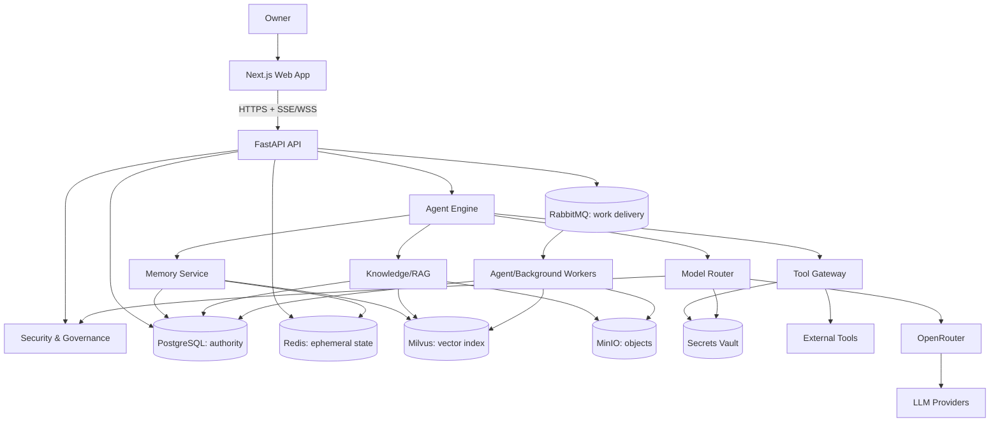

# NOVO System Architecture

**Status:** Draft for owner review
**Version:** 0.1 | **Owner:** Jay Rana | **Updated:** 2026-06-23
**Default security mode:** Assistant Mode

## 1. Purpose

This is the parent architecture contract for NOVO. It defines component ownership, communication, trust boundaries, consistency, deployment, and failure behavior. Database, API, agent, memory, RAG, security, dashboard, and roadmap specifications must refine - not silently contradict - it.

NOVO begins as a single-owner personal system, but every resource retains explicit ownership so safe sharing can be added later.

## 2. Architectural principles

1. Owner control precedes convenience.
2. Model calls, memory access, tool calls, decisions, and approvals are traceable.
3. Secrets never enter prompts, memory, queues, URLs, logs, or normal application tables.
4. Authoritative state is separate from caches, vector indexes, messages, and blobs.
5. Authorization, approval, privacy, secrets, and audit failures fail closed.
6. Optional capabilities degrade visibly rather than corrupting state.
7. Providers and infrastructure sit behind application-owned interfaces.
8. The system runs privately on one host first and can scale later.

Priority: safety -> privacy/integrity -> explainability/auditability -> correctness -> recovery -> latency -> cost -> convenience.

## 3. System overview

Clients never access infrastructure, model providers, or credentials directly. OpenRouter, models, websites, email, documents, and tool providers are untrusted external systems.

## 4. Architecture style

NOVO starts as a **modular monolith with separate worker processes**, not microservices. Modules: identity, conversations, agents, memory, knowledge, tools, models, governance, audit, files, jobs, and observability. Modules use public application interfaces or events instead of reading each other's private tables.

Core logic does not depend on FastAPI or vendor SDK types. Adapters implement ports such as `ConversationRepository`, `SessionStore`, `VectorIndex`, `ObjectStore`, `EventPublisher`, `ModelGateway`, and `SecretsProvider`.

Runtime roles:

- **API:** HTTP, SSE, and WebSocket traffic.
- **Agent worker:** resumable agent runs.
- **Background worker:** ingestion, embeddings, consolidation, cleanup, notifications.
- **Scheduler:** publishes due work; never executes it.

Bounded reads, policy checks, approvals, and chat streaming are synchronous. Ingestion, embeddings, long agent runs, voice, automations, exports, and maintenance are jobs returning `202 Accepted` and a durable `job_id`.

## 5. Component contracts

### 5.1 Frontend - Next.js

Provides chat, Control Center, memory, documents, approvals, audit, agent runs, tools, analytics, settings, and kill-switch UI. It shows exact action previews and honest pending/degraded/failure states.

- HTTPS/JSON for commands and queries.
- SSE for tokens, run events, and job progress.
- WebSocket only for bidirectional voice/computer control.
- MinIO upload only via short-lived object/method-specific presigned URL.
- `HttpOnly`, `Secure`, `SameSite` session cookie; CSRF protection on mutations. Browser sessions should not rely on localStorage for bearer persistence.
- Restrictive CSP; all model/document/tool content rendered as untrusted.
- UI hiding is never authorization; no credentials enter client bundles.

### 5.2 Backend - FastAPI

Owns versioned APIs, Pydantic contracts, authentication, orchestration, governance enforcement, durable writes, job submission, telemetry, and audit.

Every request: create trace ID -> enforce transport limits -> authenticate -> check session/kill switch -> rate limit -> validate schema -> authorize exact capability/resource -> run use case -> commit required audit evidence -> return privacy-safe typed output.

### 5.3 PostgreSQL - durable authority

Authoritative for identities, sessions, conversations/messages, memories/revisions, document/chunk metadata, agent runs/steps, tools/capabilities, permissions/policies, approvals, jobs/outbox, model usage, and audit events.

- PostgreSQL wins over Redis, Milvus, and RabbitMQ.
- Every owner resource has `owner_id`; use opaque UUIDs and UTC `TIMESTAMPTZ`.
- Constraints enforce invariants; Alembic manages migrations.
- Binaries go to MinIO and secrets to the vault.
- Cross-system effects use a transactional outbox.

### 5.4 Redis - reconstructable ephemeral state

Stores session cache/revocations, short-term working memory, progress/stream cursors, rate limits, leased locks, hot policy versions, and immediate kill-switch projection.

- Never the only copy of a durable fact.
- Namespaced/versioned keys with TTLs; example `novo:v1:{env}:{owner}:session:{id}`.
- Total loss may hurt performance, never destroy truth.
- Pub/Sub is for disposable UI events, never durable jobs.

### 5.5 Milvus - derived vector index

Stores vectors for document chunks, semantic memories, and optional episode summaries.

- PostgreSQL owns text, owner, classification, lifecycle, permission, and index state.
- Vector metadata includes canonical ID, owner, type, classification, policy scope, source/version, and embedding version.
- Filter by policy before search and re-authorize canonical records after search.
- A PostgreSQL restriction/deletion blocks use immediately even before vector cleanup.
- Version collections by model/dimension; Milvus must be fully rebuildable.

### 5.6 RabbitMQ - durable asynchronous delivery

Exchanges: `novo.commands`, `novo.events`, and `novo.dead_letter`. Initial queues: `document.ingest`, `document.embed`, `memory.embed`, `memory.consolidate`, `agent.execute`, `voice.transcribe`, `automation.execute`, `audit.export`, and `maintenance.cleanup`.

- At-least-once delivery; consumers are idempotent.
- Acknowledge after durable commit; bounded exponential retry with jitter.
- Envelope has message/schema IDs, type, time, owner, correlation, and causation.
- Large payloads use MinIO references; messages contain no secrets.
- Outbox plus processed-message records prevents lost/duplicate effects.
- RabbitMQ is not a business database or audit log.

### 5.7 MinIO - objects

Stores documents, media, screenshots, artifacts, quarantined uploads, and encrypted exports/backups. Private buckets: `novo-documents`, `novo-media`, `novo-artifacts`, `novo-quarantine`, `novo-backups`.

- Opaque object keys; filenames remain metadata.
- PostgreSQL stores owner, class, checksum, size, detected MIME, encryption, retention, and version.
- Upload to quarantine -> verify -> malware scan -> promote.
- Private access, short-lived presigned URLs, encryption, and versioning.
- Governed deletion and PostgreSQL/MinIO orphan reconciliation.

### 5.8 OpenRouter - external model gateway

Only the backend's provider-neutral Model Gateway calls OpenRouter. Routing considers capability, sensitivity, provider policy, context, latency, availability, and budget.

Flow: minimize context -> retrieve authorized data -> Privacy Firewall/secret scan -> provider eligibility -> scoped key from vault -> timed call -> validate untrusted output -> record model/reason/tokens/latency/cost/status without raw sensitive prompts.

Secret and Restricted data cannot leave NOVO by default. Confidential data needs an explicit compatible policy. Fallback cannot choose a weaker provider. Models propose actions but cannot authorize or execute them.

### 5.9 Security and Governance - mandatory control plane

Contains the Policy Decision Point, enforcement at all protected boundaries, Privacy Firewall, Approval Engine, Secrets Provider, append-only Audit Service, and Kill Switch. No alternate path may reach a model, tool, protected memory, export, or destructive operation.

### 5.10 Observability

Operational telemetry is separate from audit evidence. Langfuse may track AI performance/cost but is not the audit authority. Propagate W3C trace context and shared request, correlation, owner, and agent-run IDs. Redact secrets and tokens before emission.

## 6. Communication matrix

| Source | Destination | Protocol | Purpose |
|---|---|---|---|
| Client | FastAPI | HTTPS/JSON | Commands, queries, approvals |
| Client | FastAPI | SSE/WSS | Streams and realtime control |
| Application | PostgreSQL | PostgreSQL/TLS | Transactions |
| Application | Redis | RESP/TLS/private | Ephemeral state |
| Memory/RAG | Milvus | gRPC/TLS/private | Vector operations |
| API/workers | RabbitMQ | AMQP/TLS | Commands/events |
| Files/workers | MinIO | S3/HTTPS | Objects |
| Model Gateway | OpenRouter | HTTPS | Filtered model calls |
| Tool Gateway | Tool provider | HTTPS | Authorized tool calls |
| Backend | Vault | Secure provider API | Scoped credentials |

Network access never grants authorization. Each runtime role receives least-privilege service credentials.

## 7. Critical flows

### 7.1 Chat

Authenticate/mode/kill-switch -> persist user message -> start agent run -> obtain policy scope -> retrieve and re-authorize context -> minimize/redact -> select eligible model -> OpenRouter call -> validate response -> persist response, routing explanation, usage and audit -> SSE to client.

### 7.2 Tool action

Agent produces typed proposal -> Tool Gateway validates -> Governance evaluates actor, exact target/arguments, risk, mode, policy and budget -> deny or request exact preview approval -> bind approval to action hash and expiry -> recheck policy immediately before execution -> retrieve scoped credential -> idempotent execution -> sanitize/persist/audit result.

Any change to tool, account, recipient/target, payload, amount/path, visibility, or deadline invalidates approval.

### 7.3 Document ingestion

Authorize -> pending PostgreSQL record -> presigned quarantine upload -> verify/scan -> outbox -> RabbitMQ -> sandbox parse -> PostgreSQL chunks/lineage -> batched embeddings -> versioned Milvus upsert -> visible ready/partial/failed state.

### 7.4 Kill switch

Strong authentication -> durable PostgreSQL state/audit + immediate Redis flag -> reject new agent/model/tool/automation/export work -> worker checkpoint cancellation -> provider cancellation/revocation where possible. Recovery UI remains locally available. Sensitive work never auto-resumes.

## 8. Data authority and consistency

| Data | Authority | Derived/temporary |
|---|---|---|
| Identity/policy | PostgreSQL | Redis cache |
| Conversations | PostgreSQL | Redis recent context |
| Memories | PostgreSQL | Redis/Milvus |
| Documents | PostgreSQL + MinIO | Milvus |
| Runs/approvals/jobs | PostgreSQL | Redis/RabbitMQ |
| Secrets | Vault | Short-lived process memory |
| Audit | PostgreSQL append-only | Optional read projection |

No distributed transactions. Use local transaction + outbox, workflow state machines, compensating actions, and idempotency keys. Security state is authoritative/fail-closed; caches, indexes, analytics, and progress may be eventually consistent.

## 9. Trust and deployment

Trust zones: client, application, private data, external providers, and isolated automation/parser sandbox. Expose only reverse proxy/API. Keep all infrastructure/admin/metrics ports private; use TLS, service identity, restricted egress, and role-separated credentials.

External text is data, not authority: it cannot alter policy, approve actions, request secrets, redefine tool schemas, or suppress audit.

Development uses containers for frontend, API, workers, scheduler, PostgreSQL, Redis, Milvus, RabbitMQ, MinIO, optional Langfuse, and a dev vault. Lightweight profiles allow core development without every service.

Initial production may use one hardened private host with encrypted storage, TLS, private networks, health/restart policies, limits, monitoring, separate credentials, encrypted off-host backup, and tested restore. It is not highly available. Later scale API replicas, workers, and data services independently without weakening governance.

## 10. Failure behavior

| Failure | Required behavior |
|---|---|
| PostgreSQL | Reject durable writes and sensitive actions. |
| Redis | Authoritative fallback where safe; disable unsafe dependent features. |
| Milvus | Non-semantic work continues; RAG/memory marked degraded. |
| RabbitMQ | Retain outbox/job; publish later, never hide work in API. |
| MinIO | Metadata stays; object operations pause/retry. |
| Model | Eligible bounded fallback or transparent unavailable error. |
| Tool provider | Retry only if idempotent; otherwise require review. |
| Governance/audit | Protected action fails closed. |
| Worker | Redelivery plus idempotency prevents duplicate effects. |

All network calls have deadlines; retries are bounded with backoff/jitter. Liveness tests the process, readiness tests its role, and detailed dependency health is authenticated.

## 11. Backup, deletion, and conventions

Restore: vault/key access -> PostgreSQL -> MinIO -> checksum reconciliation -> Milvus rebuild -> RabbitMQ/outbox replay -> Redis warm-up -> integrity checks -> enable agents/tools.

Deletion reports logical, physical, and backup-retention status and tracks every store without copying deleted content into audit.

Use UUIDs, UTC, ISO 8601, `/api/v1`, independently versioned events, strict tool schemas, safe machine-readable errors, `snake_case` in Python/database, and `camelCase`/`PascalCase` in TypeScript/React.

## 12. Architecture decisions

| ID | Decision | Status |
|---|---|---|
| ADR-001 | Modular monolith + separate workers | Proposed |
| ADR-002 | PostgreSQL is durable authority | Blueprint-approved |
| ADR-003 | Milvus is rebuildable | Blueprint-approved |
| ADR-004 | RabbitMQ at-least-once + idempotency | Proposed |
| ADR-005 | MinIO objects, PostgreSQL metadata | Blueprint-approved |
| ADR-006 | OpenRouter behind Model Gateway | Blueprint-approved |
| ADR-007 | SSE default; WSS for bidirectional realtime | Proposed |
| ADR-008 | Transactional outbox | Proposed |
| ADR-009 | Governance at every protected boundary | Product principle |

## 13. Owner decisions needed

1. Production target: Windows, Linux, home server, or cloud VM.
2. Secrets provider: OS store, self-hosted vault, or managed service.
3. Authentication: password plus passkey/TOTP, OS identity, or OIDC.
4. Which data classifications each external provider may receive.
5. Data residency and allowed processing regions.
6. Backup destination and recovery objectives (RPO/RTO).
7. Local or external Langfuse.
8. Local machine, private LAN/VPN, or internet access.

Default assumption: private/local access, strong authentication, encrypted off-host backup, and no external transmission of Secret or Restricted data.

## 14. Recommended additions

These are recommendations for owner approval, not automatic commitments:

1. **Capability-scoped credentials:** independent read/write scopes and revocation per integration.
2. **Action preview and dry-run:** show the exact external effect before execution.
3. **Provenance ledger:** retain source/transformation lineage for memories, chunks, and answers.
4. **Policy simulator:** answer "would NOVO allow this?" without executing anything.
5. **Safety budgets:** time-window limits for spend, recipients, file changes, model cost, and run volume.
6. **Recovery safe mode:** local repair interface with agents, models, and tools disabled.
7. **Data-egress register:** show provider, data category, reason, policy, and time without copying sensitive payloads.

## 15. Definition of done

Accept this specification after proposed decisions are reviewed, every durable fact has one authority, every communication path has protocol/security/failure rules, deployment and recovery targets are selected, protected paths include policy/approval/audit/revocation, and later specifications reference these boundaries.

The next document is `03_DATABASE_DESIGN.md`, which must translate these authorities, ownership rules, outbox behavior, audit requirements, and lifecycle states into a complete relational design before application code is written.

## 16. Version 2 Architecture Extensions

The following components are approved architectural directions derived from the Project Vision. They are Version 2 boundaries, not permission to bypass Version 1 governance.

### 16.1 Companion Service

The Companion Service coordinates continuity, emotional-signal interpretation, owner-controlled personality, goals, projects, interests, milestones, and life events. It retrieves information only through governed Memory and Knowledge interfaces. It does not own authorization, claim consciousness, diagnose the owner, or optimize for dependency.

Internal capabilities:

- Emotional Signal Analyzer for uncertain, sourced, expiring observations
- Continuity and Relationship Tracker for projects, milestones, and conversational continuity
- Personality Engine for transparent and resettable communication preferences
- Goals and Growth Service for owner-defined progress and reflection

### 16.2 Memory Candidate and Consolidation Pipeline

Conversation or event -> candidate extraction -> privacy classification -> confidence, importance, novelty and recurrence scoring -> contradiction/deduplication -> consolidate, review, keep temporarily, or reject -> revisioned memory -> optional Milvus and Neo4j projection.

Consolidation is asynchronous and idempotent. Sensitive candidate promotion follows memory policy and may require owner review.

### 16.3 Reflection Agent

The Reflection Agent runs on an owner-approved schedule and produces structured insight proposals from permitted episodic history. Each proposal includes evidence, confidence, classification, affected memories, and a proposed reversible change. It cannot silently rewrite the owner's identity, goals, emotional history, or security policy.

### 16.4 Knowledge Graph Service

Neo4j stores a rebuildable relationship projection. PostgreSQL remains authoritative for entity identity, content, classification, ownership, and deletion. Graph results are reauthorized against PostgreSQL before use. Graph sync uses domain events and tracks projection version and repair status.

### 16.5 Model Registry

The Model Registry supplies the Model Router with provider, model key, context window, capabilities, price, observed latency, availability, health, and classification eligibility. Model health and cost change over time; routing records the registry version used.

### 16.6 Prompt Registry

Prompts are versioned assets rather than hardcoded strings. The registry supports system, agent, tool, companion, and memory/reflection purposes. Immutable versions, typed variables, evaluation status, activation, rollback, and prompt hashes make model behavior reproducible. Agents cannot edit protected production prompts.

Recommended source folders: prompts/system, prompts/agents, prompts/tools, prompts/companion, and prompts/memory.

### 16.7 Domain Event Bus

Domain events are immutable application facts. RabbitMQ transports them; it does not define or own them. PostgreSQL outbox publication provides atomicity. Consumers are idempotent and schema-version aware.

Initial Version 2 events include conversation.completed, memory.candidate_created, memory.consolidated, reflection.completed, goal.updated, document.indexed, graph.projection_updated, prompt.activated, model.health_changed, computer.session_completed, and notification.requested.

### 16.8 Computer Control Layer

The Computer Use Agent plans and observes; the Computer Control Layer validates and executes inside a restricted sandbox. Playwright is preferred for deterministic browser interaction. Every action is typed, policy-checked, bounded, stoppable, evidenced, and audited. Unexpected UI state stops execution.

### 16.9 Visual references

- diagrams/V2_SYSTEM_ARCHITECTURE.md
- diagrams/MEMORY_COMPANION_PIPELINE.md
- diagrams/EVENTS_AND_REGISTRIES.md
- diagrams/COMPUTER_CONTROL_FLOW.md

## 17. NOVO Orchestrator, Guardrails, and Fast Response

### 17.1 NOVO Orchestrator

The Orchestrator is the request-routing subsystem above agents, memory, RAG, tools, and models. It classifies intent, risk, complexity, latency target, privacy constraints, and required capabilities.

Responsibilities:

- Select fast path or deep path
- Select synchronous response or asynchronous job
- Choose recent conversation, structured memory, semantic memory, episodic memory, RAG, or graph context
- Decide whether tools or an agent run are necessary
- Select model tier through the Model Router and Registry
- Enforce context and cost budgets
- Create run, step, decision, and correlation traces when required
- Route long work through jobs, outbox, RabbitMQ, and workers

The Orchestrator never authorizes its own decisions. Every protected path is enforced by Guardrails and Governance.

### 17.2 NOVO Guardrails Engine

Guardrails are policy enforcement points around input, retrieval, model calls, output, memory mutation, tools, and egress.

- Input: secret detection, injection detection, classification filtering, provider eligibility, minimization
- Output: schema validation, unsafe-output handling, action-sensitive claim validation, typed tool arguments
- Action: capability, integration, approval, classification, mode, idempotency, and destination checks
- Memory: provenance, contradiction, secret rejection, inference review, and retrieval reauthorization
- Egress: destination eligibility, redaction, minimization, and data-egress audit

No model output directly mutates state or executes a tool.

### 17.3 Fast path

Use for chat, follow-ups, simple explanations, small code help, compact lookups, lightweight summaries, and low-risk no-tool work.

Fast-path order: current context -> cached summary -> indexed structured lookup -> optional minimal semantic retrieval -> Tier 1 model -> output validation.

It skips reflection, broad RAG, graph traversal, full planning, and background consistency work unless the request requires them.

### 17.4 Deep path

Use for multi-step tasks, tool-heavy work, approvals, consolidation, reflection, research, large documents, automation, and graph reasoning.

Deep path creates structured runs and steps, performs targeted broader retrieval, uses Tier 2 reasoning when justified, and moves expensive work to asynchronous workers.

### 17.5 Execution routing matrix

| Request | Path | Retrieval | Model tier | Tools |
|---|---|---|---|---|
| Simple chat/follow-up | Fast | Recent conversation | Tier 1 | None |
| Coding explanation | Fast, escalate if needed | Conversation and optional docs | Tier 1 then Tier 2 | Optional |
| Exact memory question | Fast | Structured memory first | Tier 1 | None |
| Document question | Fast or Deep | Targeted chunks, semantic if needed | Tier 1 or Tier 2 | Optional |
| Multi-step task | Deep | Targeted multi-source | Tier 2 | Yes |
| Approval-bound action | Deep | Minimum targeted | Tier 2 | Yes |
| Ingestion/embedding/reflection | Async Deep | Job-specific | Background | Workers |
| Graph reasoning | Deep | Graph plus canonical reload | Tier 2 | Optional |

### 17.6 Initial model strategy

OpenRouter is the initial gateway for free and low-cost experimentation. The internal interface remains provider-neutral for future local, OpenAI, Anthropic, Gemini, or other providers.

- Tier 1: fast default model for chat, reformulation, simple code, classification, summaries, and low-risk extraction drafts.
- Tier 2: stronger reasoning for debugging, contradictions, synthesis, tool planning, and safety-sensitive reasoning.
- Tier 3: future local/private model for Secret or Restricted local-only work, offline mode, and private fallback.

Free models may have unstable latency, availability, long-context quality, hallucination rates, and tool JSON. Compensations are strict schemas, smaller prompts, deterministic flows, repair validation, health-aware fallback, and refusal when safe output cannot be obtained.

### 17.7 Latency-first rules

1. Do not run full memory, RAG, and graph retrieval for every request.
2. Do not create a full agent plan for ordinary chat.
3. Never run reflection during an interactive response.
4. Avoid tools when current authorized context can answer safely.
5. Prefer IDs and cached summaries over duplicated payloads.
6. Run ingestion, embedding, reflection, export, rebuild, and long automation asynchronously.
7. Measure user response latency separately from background consistency.
8. Keep hot-path policy evaluation compact using versioned, safely cached policy snapshots.
9. Prefer deterministic retrieval and validation before LLM reasoning.
10. Never trust free-model tool output without validation.

Central design: architecture/NOVO_ORCHESTRATOR_AND_GUARDRAILS.md.
