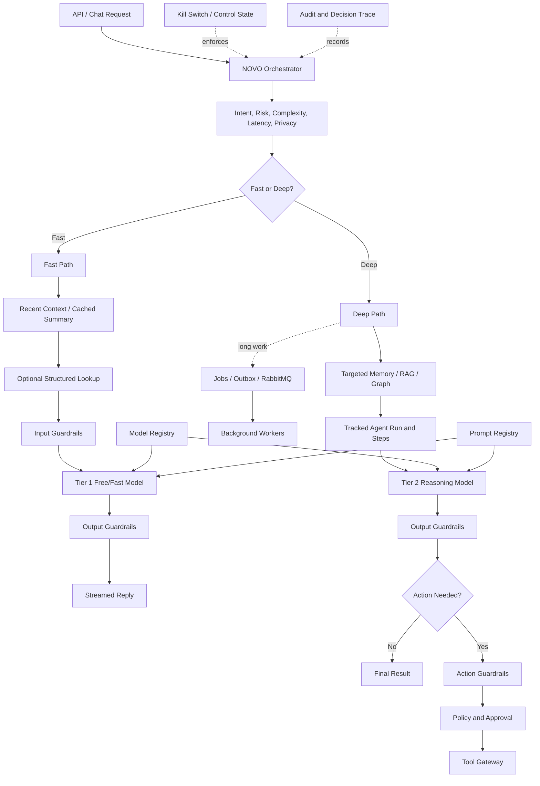

# NOVO Version 2 System Architecture

## Complete component map

~~~mermaid
flowchart TB
    Owner["Owner"] --> UI["Next.js Control Center"]
    UI --> API["FastAPI API"]

    subgraph Control["Security and Governance Control Plane"]
        Policy["Policy Decision Point"]
        Privacy["Privacy Firewall"]
        Approval["Approval Engine"]
        Audit["Audit Service"]
        Kill["Kill Switch"]
        Vault["Secrets Provider"]
    end

    subgraph Intelligence["Intelligence Layer"]
        Agent["Agent Engine"]
        Companion["Companion Service"]
        ModelRouter["Model Router"]
        ModelRegistry["Model Registry"]
        PromptRegistry["Prompt Registry"]
        Computer["Computer Control Layer"]
    end

    subgraph CompanionParts["Companion Intelligence"]
        Emotion["Emotional Signal Analyzer"]
        Continuity["Continuity and Relationship Tracker"]
        Personality["Personality Engine"]
        Growth["Goals and Growth Service"]
    end

    subgraph MemoryLayer["Memory and Knowledge"]
        Memory["Memory Service"]
        Candidate["Memory Candidate Pipeline"]
        Consolidation["Consolidation Service"]
        Reflection["Reflection Agent"]
        RAG["RAG Service"]
        Graph["Knowledge Graph Service"]
    end

    subgraph Durable["Storage and Delivery"]
        PG[("PostgreSQL - authority")]
        Redis[("Redis - ephemeral")]
        Milvus[("Milvus - vectors")]
        Neo4j[("Neo4j - derived graph")]
        MinIO[("MinIO - objects")]
        MQ[("RabbitMQ - delivery")]
    end

    API --> Policy
    API --> Agent
    Agent --> Companion
    Agent --> ModelRouter
    Agent --> Computer
    Companion --> Emotion
    Companion --> Continuity
    Companion --> Personality
    Companion --> Growth
    Companion --> Memory
    Memory --> Candidate
    Candidate --> Consolidation
    Consolidation --> Reflection
    Reflection --> Memory
    Memory --> RAG
    Memory --> Graph
    ModelRouter --> ModelRegistry
    ModelRouter --> PromptRegistry
    ModelRouter --> Privacy
    Computer --> Approval

    Policy --> PG
    Audit --> PG
    Memory --> PG
    Memory --> Redis
    Memory --> Milvus
    Graph --> Neo4j
    RAG --> MinIO
    ModelRegistry --> PG
    PromptRegistry --> PG
    Agent -. commands/events .-> MQ
    MQ -. work .-> Consolidation
    MQ -. work .-> Reflection

    Policy -. guards .-> Agent
    Policy -. guards .-> Companion
    Policy -. guards .-> Memory
    Policy -. guards .-> Computer
    Kill -. stops .-> Agent
    Kill -. stops .-> Computer
    Vault -. scoped credentials .-> ModelRouter
    Vault -. scoped credentials .-> Computer
~~~

## Component boundaries

| Component | Owns | Must not do |
|---|---|---|
| Companion Service | Companion orchestration and continuity | Bypass memory policy or claim consciousness |
| Emotional Signal Analyzer | Uncertain emotional observations | Diagnose, authorize, manipulate, or override intent |
| Personality Engine | Configurable response style | Hide adaptation or create dependency |
| Growth Service | Owner-defined goals and progress | Define success for the owner |
| Consolidation Service | Score, deduplicate, merge, expire candidates | Silently rewrite approved memory |
| Reflection Agent | Propose insights and memory changes | Directly activate sensitive memory |
| Knowledge Graph Service | Entity/relation projection and graph query | Become authority for permissions or memory text |
| Model Registry | Model capability, price, context, health | Store provider secrets |
| Prompt Registry | Versioned templates and bindings | Allow runtime agents to rewrite protected prompts |
| Computer Control Layer | Sandboxed GUI execution | Operate outside policy, approval, or evidence capture |

## Knowledge graph authority

PostgreSQL stores canonical entities, memories, ownership, classifications, and graph synchronization state. Neo4j stores a derived relationship projection.

~~~mermaid
flowchart LR
    PG["PostgreSQL canonical records"] --> Sync["Graph Sync Worker"]
    Sync --> Neo4j["Neo4j relationship projection"]
    Neo4j --> Query["Graph Query"]
    Query --> ReAuth["PostgreSQL reauthorization"]
    ReAuth --> Context["Permitted reasoning context"]
~~~

Example relationship:

~~~mermaid
graph LR
    Jay["Jay"] -->|WORKS_ON| NOVO["NOVO"]
    NOVO -->|USES| Milvus["Milvus"]
    NOVO -->|USES| PostgreSQL["PostgreSQL"]
    NOVO -->|HAS_GOAL| Privacy["Owner-controlled privacy"]
~~~

## Orchestrated request flow

Fast Path still runs required Guardrails. Deep Path adds planning, broad retrieval, durable progress, tools, approvals, and asynchronous execution only when justified.

Central specification: ../architecture/NOVO_ORCHESTRATOR_AND_GUARDRAILS.md.
