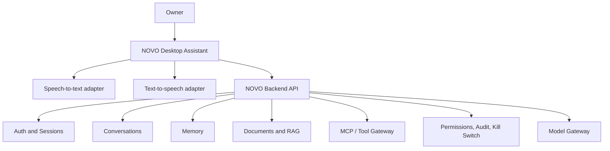

# NOVO Desktop Assistant Architecture

**Status:** Draft for implementation
**Owner:** Jay Rana
**Updated:** 2026-06-30

## 1. Purpose

The NOVO Desktop Assistant is the primary daily-use interface for NOVO. It is the local GUI, voice surface, and presence layer that lets the owner talk to NOVO, see what it is doing, and receive answers from the backend.

The desktop assistant is not the brain of NOVO. It is the face, voice, and interaction shell. The backend remains responsible for memory, RAG, tools, permissions, audit, model calls, approvals, and kill-switch enforcement.

## 2. Product Role

The desktop assistant should provide:

- A real local app window
- Text input and chat display
- Voice input and speech output
- Listening, thinking, speaking, blocked, and degraded states
- Animated assistant presence
- Source/citation display when the backend provides evidence
- Tool/action status display
- Approval prompts returned by backend governance
- Clear backend-unavailable and permission-denied states

The existing Next.js frontend remains the NOVO Control Center for deeper administration, inspection, and recovery.

## 3. Boundary Rule

The desktop app must not directly read or mutate:

- PostgreSQL
- Redis
- Documents or document indexes
- Email accounts
- Calendar accounts
- MCP/tool credentials
- Memory stores
- Model provider APIs
- Secrets or API keys

It talks to NOVO through backend APIs and governed realtime channels.

## 4. Target Architecture

## 5. First Implementation Scope: E2.5

E2.5 should be deliberately small.

Implement:

- Desktop app scaffold
- Backend health check
- Login/bootstrap or local session flow
- Text message input
- Conversation response display
- Streaming response support if practical
- Status states: idle, connecting, thinking, responding, error
- Animated visual placeholder
- Push-to-talk/microphone button placeholder
- Threaded or async backend calls so the GUI does not freeze

Do not implement yet:

- Direct document ingestion
- Direct email reading
- Direct MCP tool execution
- Autonomous actions
- Wake word
- Spoken approvals for sensitive actions
- Always-on background listening

## 6. Voice Threading Model

The GUI must remain responsive while audio and network work happen.

Recommended worker lanes:

- Main GUI thread: drawing, input, animation, user interactions
- Backend worker: HTTP requests, SSE/event handling, retry/degraded state
- Speech-to-text worker: microphone capture and transcription
- Text-to-speech worker: playback queue and interruption handling

Workers communicate with the GUI through a small event queue, not direct UI mutation from background threads.

## 7. State Model

Desktop UI states:

- offline: backend unreachable
- signed_out: no active session
- idle: ready for text or voice
- listening: microphone active
- transcribing: speech being converted to text
- thinking: backend/model work in progress
- speaking: speech output playing
- waiting_for_approval: backend requires owner decision
- blocked: permission, kill switch, or policy stopped the request
- degraded: dependency or model fallback occurred

The backend is authoritative for conversation, memory, permissions, and audit state. Local state is presentation only.

## 8. Backend APIs Needed First

Use existing APIs first:

- `GET /api/v1/health/live`
- `POST /api/v1/auth/login`
- `POST /api/v1/auth/bootstrap` for local setup if needed
- `GET /api/v1/auth/me`
- `GET /api/v1/conversations`
- `POST /api/v1/conversations`
- `POST /api/v1/conversations/{conversation_id}/messages`
- `GET /api/v1/conversations/responses/{response_id}/events`

Future APIs may add a dedicated desktop session or voice-session endpoint, but E2.5 should reuse the current chat foundation.

## 9. Technology Options

Recommended starting options:

- Python + CustomTkinter: fastest simple local GUI path
- Python + PySide6: stronger professional desktop UI path
- Python + Pygame: useful for animated assistant visuals
- Tauri: good if the UI should share web technologies but run as a native app
- Electron: broad ecosystem, heavier runtime

Selection criteria:

- Easy Windows development
- Non-blocking audio support
- Good animation support
- Simple packaging
- Clean backend HTTP/SSE client support
- Low maintenance burden

## 10. Security Rules

- No backend tokens in plaintext config files.
- Prefer HttpOnly/browser-style cookies where possible; otherwise use an OS credential store or encrypted local storage for desktop sessions.
- Never log raw voice transcripts that may contain secrets unless the backend explicitly stores a governed conversation message.
- Do not store API keys in the desktop app.
- Do not send microphone audio to third-party services without explicit configured policy.
- Treat speech recognition text as untrusted user input that still passes backend guardrails.
- Sensitive actions require backend approval and audit.

## 11. Relationship With Control Center

Desktop Assistant:

- Ask questions
- Speak answers
- Show immediate task state
- Present quick approvals or blockers
- Display compact citations and sources

Web Control Center:

- Manage permissions
- Inspect audit logs
- Review memory
- Manage documents and indexing
- Inspect model/prompt settings
- Configure tools and integrations
- Review approvals and agent runs in detail
- Use recovery and kill-switch controls

## 12. Definition of Done for E2.5

E2.5 is complete when:

- A desktop window opens reliably.
- It can connect to the local NOVO backend.
- It can send a text request to chat and display the response.
- The GUI does not freeze during backend/model waits.
- It has clear state indicators.
- It has a visible placeholder for voice interaction.
- It does not bypass backend security or directly access data stores.
- The Control Center remains available for governance and inspection.

## 13. Next After E2.5

After the desktop shell works:

1. Add real push-to-talk speech-to-text.
2. Add text-to-speech playback.
3. Add basic interruption/stop speaking.
4. Add memory-backed answers after E3.
5. Add document/RAG answers after E4.
6. Add governed MCP/tool results after E6.
7. Add advanced wake-word and always-on behavior only after security and privacy rules are mature.
